# Artworks-Frontend

**<ins>Artworks is Full Stack MERN Project for an Art Gallery Website.</ins>**

**Welcome to Artworks Project. Explore your Creative Side with Artworks Website. Check out cool and amazing Artworks posted by other users. Users can also make Account to post thier Artworks or edit Artworks posted by them. So, bring out your desire to create and inspire others with it.**

**<ins>Check It Out At</ins> -**  https://artworks-8daa9.web.app/   **(live hosting @Firebase).**

**Website Backend is hosted @Glitch. So, kindly wait for 30 seconds after the website loads to access all features.**

**<ins>Backend GitHub Repository At</ins> -**  https://github.com/visheshshukla/Artworks-Backend

**<ins>Features Of The Website</ins> -**

**Sign Up and Add New User by providing Email-Id, Picture and Password.  || Login with User Credentials and Logout.**

**Login and Add New Artworks.  ||  Add New Showrooms by providing Artwork Information and Picture.**

**Add Map Location to Artwork. ||  Logged-In Users can Edit and Delete Artworks posted by them.**

**All Users(Logged-In and Non-Logged-In) can view all Artworks and thier details(including Location on Map).**

**Secure Authentication using JWT(json-web-token) with features like Auto Logout after certain time.**

**Can be used on both Desktop and Mobile Devices.**

**<ins>Technologies Used</ins> -**

**Frontend- Using React, HTML, JavaScript, CSS, Bootstrap.  ||  Backend- Using Node Js.  ||   Database- MongoDB Atlas.**

**<ins>Packages and API's Used</ins> -**

**React for Frontend Development  ||  React Router for Frontend Navgation**

**Express as Web Framework  ||  Mongoose for MongoDB**

**OpenLayers for Map Location  ||  Multer for Image Uploads.**

**Axios for API Handling  ||  JWT(json-web-token) for Authentication**

**<ins>Desktop View</ins> -**

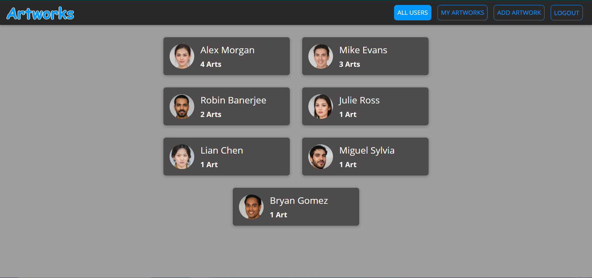 

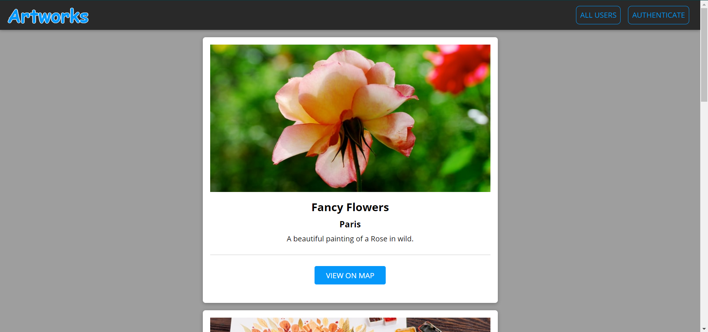

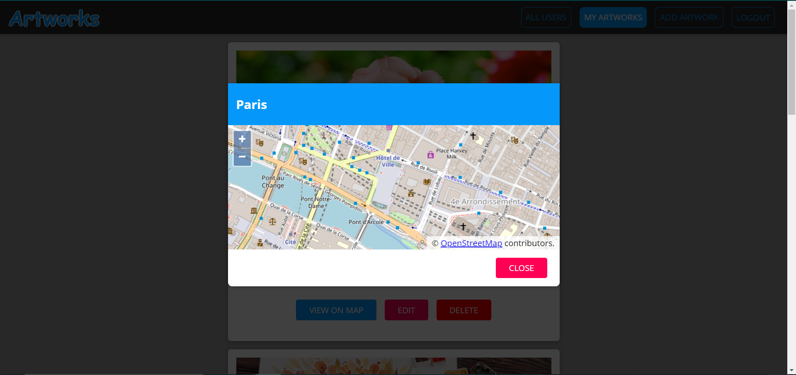 

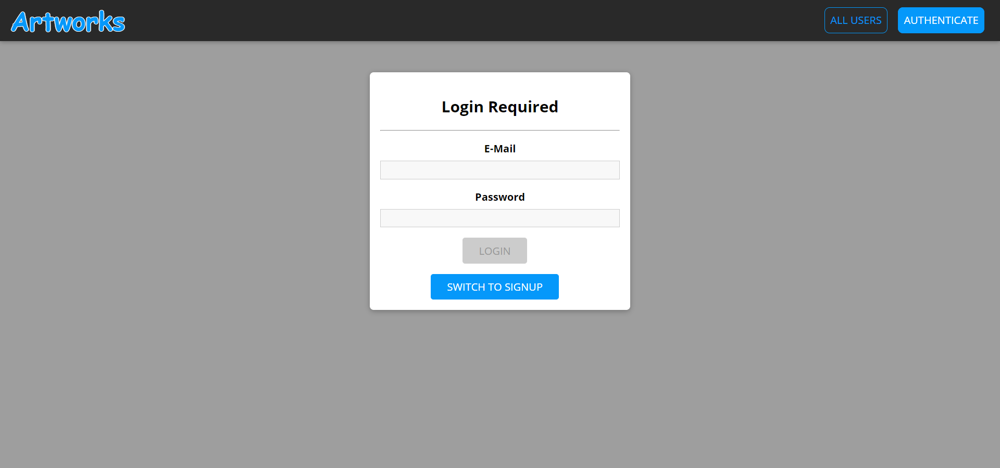

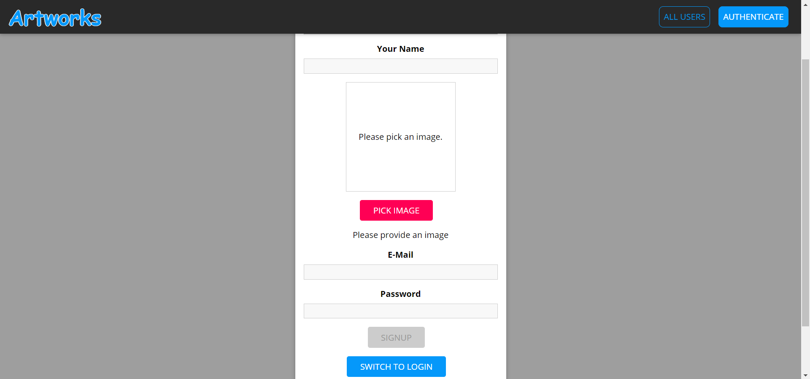 

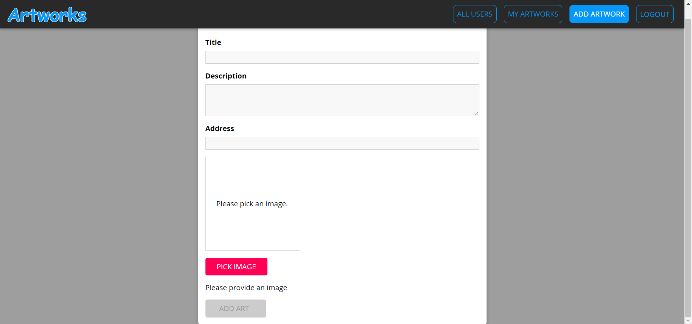

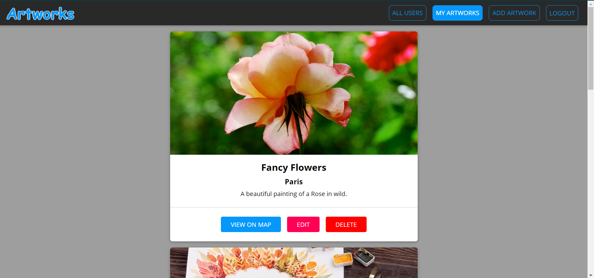 

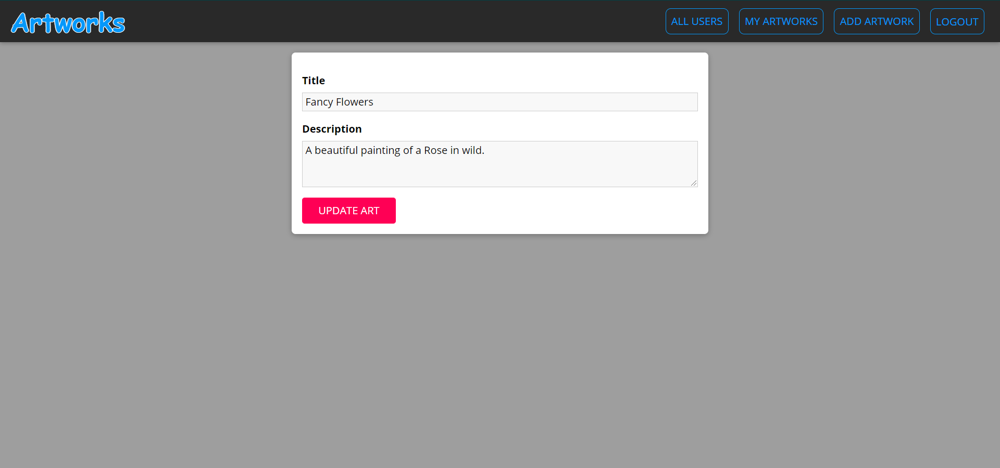

**<ins>Mobile View</ins> -**

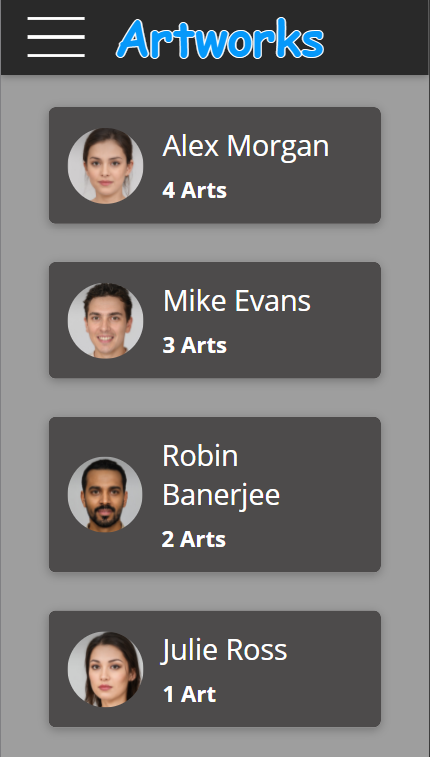  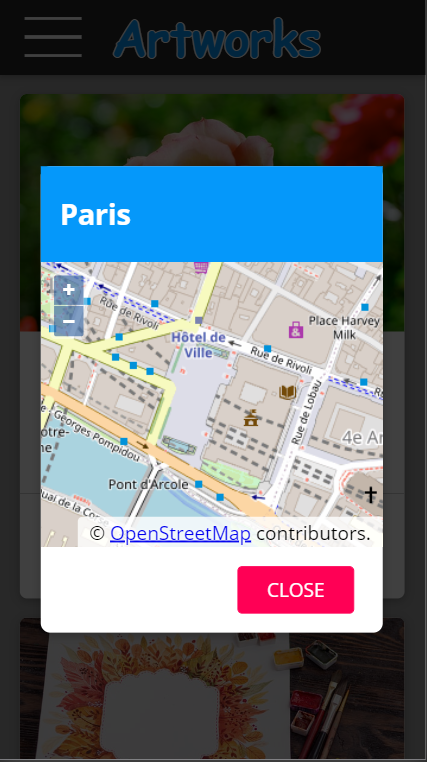

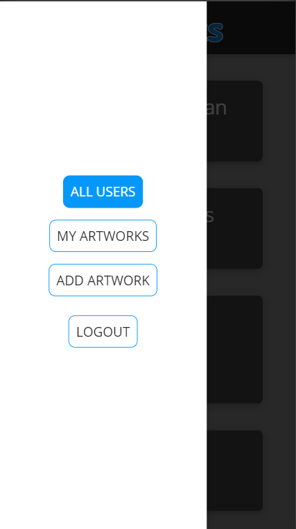 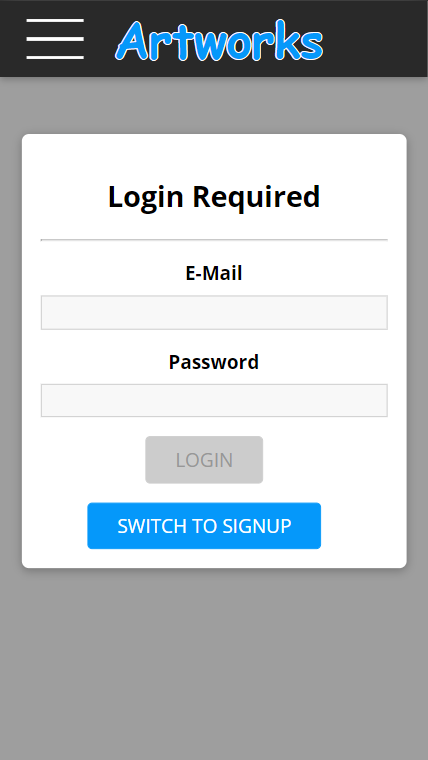 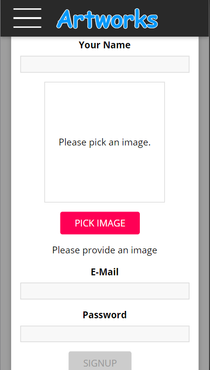

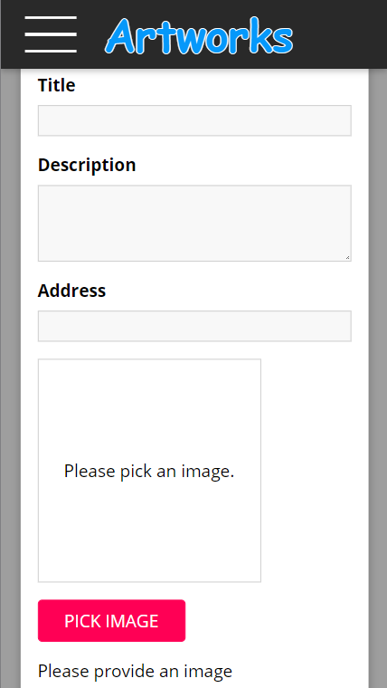 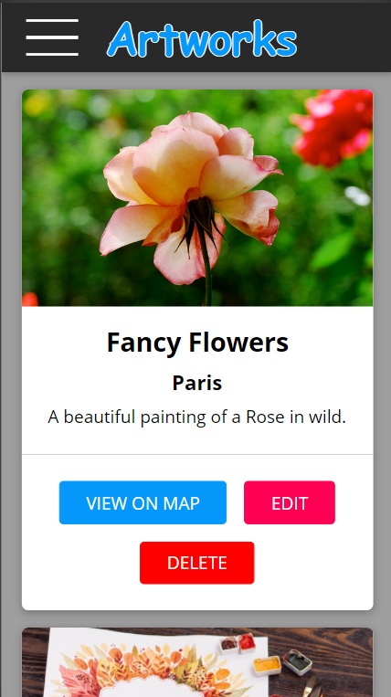 
